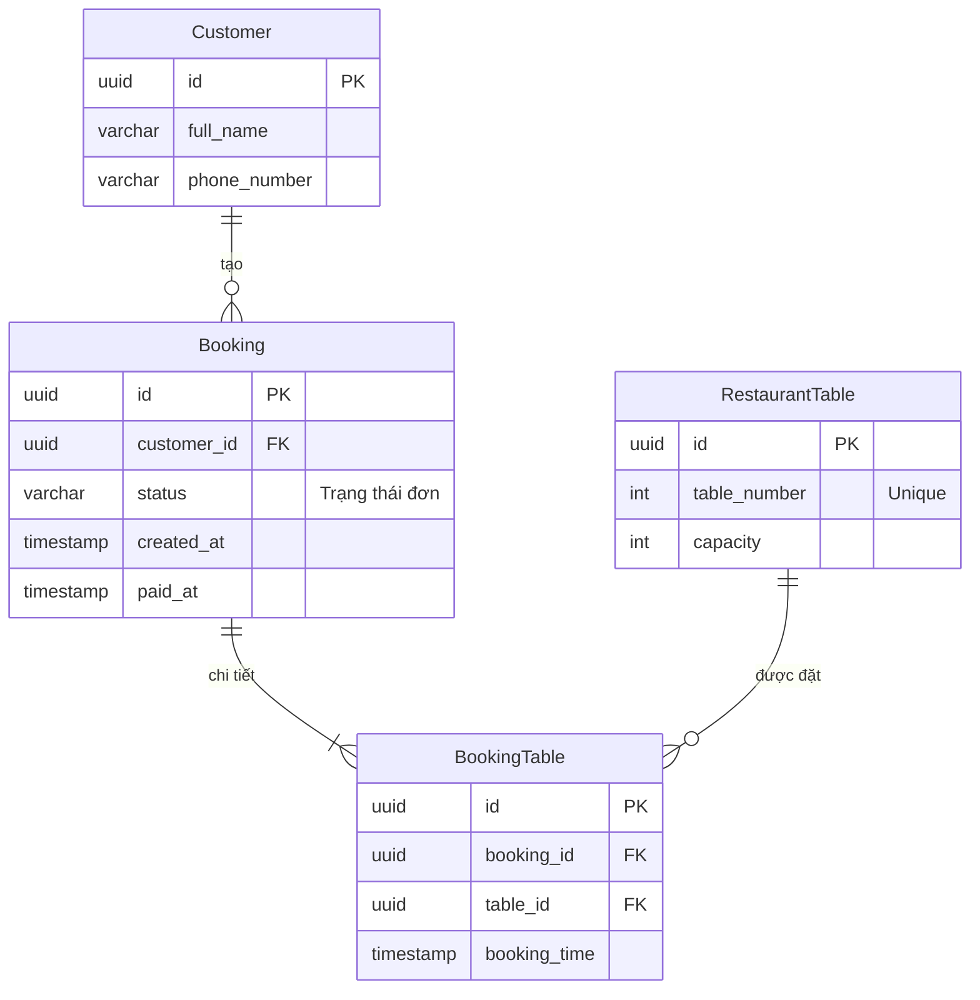

# Test 3 - Thiết kế Hệ thống Đặt bàn Nhà hàng

## I. Yêu cầu nghiệp vụ & phạm vi
**Mục tiêu:** Cho phép người dùng đặt bàn ăn theo thời gian mong muốn. Không cho phép hai đơn đặt cùng một bàn tại cùng một thời điểm nếu đơn hiện tại đang ở trạng thái **Created** hoặc **Paid**.

**Các trạng thái đơn hàng (Booking Status):**
- `Created` (Mặc định khi tạo): Đơn đặt thành công, đang chờ thanh toán (giữ bàn trong 15 phút).
- `Paid`: Đã thanh toán thành công (xác nhận giữ bàn lâu dài).
- `Canceled`: Đơn bị hủy tự động sau 15 phút chưa thanh toán hoặc chủ động hủy. Bàn được giải phóng.

**Giả định:** Một bàn phục vụ tối đa 1 đơn tại một thời điểm đặt cụ thể. Không xét khoảng thời gian phục vụ kéo dài.

---

## II. Thiết kế Cơ sở Dữ liệu

### 1. Sơ đồ thực thể quan hệ (ERD)



### 2. Ý nghĩa thiết kế
Quan hệ 1-N giữa `Booking` (Đơn đặt chung) và `BookingTable` (Chi tiết bàn ăn) giúp hỗ trợ trường hợp khách hàng muốn **đặt nhiều bàn ăn** cùng lúc trong một đơn đặt mà không cần thay đổi cấu trúc bảng sau này.

---

## III. Giải pháp chống trùng lịch đặt bàn

### 1. Vấn đề
Nếu hai người dùng cùng bấm nút đặt bàn số 5 vào lúc 19:00 ngày mai tại cùng một thời điểm (chênh lệch mili-giây):
*   Nếu hệ thống kiểm tra tuần tự (chạy `SELECT` thấy bàn trống, sau đó mới `INSERT`), cả hai tiến trình của A và B đều thấy bàn trống tại thời điểm kiểm tra, dẫn tới việc cả hai đều `INSERT` thành công dẫn đến **Trùng lịch đặt (Double Booking)**.

### 2. Hướng giải quyết: Sử dụng Database Transaction kết hợp Khóa độc quyền (Pessimistic Locking)
Để giải quyết triệt để, chúng ta thực hiện thao tác kiểm tra và chèn dữ liệu trong một **Transaction** sử dụng cơ chế **khóa hàng (Row-level Locking)** với câu lệnh `SELECT ... FOR UPDATE`.

#### Quy trình xử lý chi tiết:
1.  **Bắt đầu Transaction.**
2.  **Khóa và kiểm tra trạng thái bàn tại khung giờ đó:**
    Truy vấn lịch đặt hiện có với trạng thái `Created` hoặc `Paid` đồng thời áp dụng `FOR UPDATE` để khóa các dòng dữ liệu liên quan, ngăn các transaction khác đọc/ghi đồng thời.
3.  **Xử lý kết quả kiểm tra:**
    *   Nếu truy vấn trả về dữ liệu (đã có người đặt) $\rightarrow$ Thực hiện **Rollback** và báo lỗi.
    *   Nếu không có dữ liệu (bàn trống) $\rightarrow$ Thực hiện **INSERT** thông tin đơn hàng và commit.
4.  **Commit Transaction.**

#### Câu lệnh SQL cho quy trình tạo đơn:

```sql
BEGIN;

SELECT 1
FROM BookingTable bt
JOIN Booking b ON bt.booking_id = b.id
WHERE bt.table_id = :table_id
  AND bt.booking_time = :booking_time
  AND b.status IN ('Created', 'Paid')
FOR UPDATE;

INSERT INTO Booking (id, customer_id, status, created_at)
VALUES (
    :booking_id,
    :customer_id,
    'Created',
    NOW()
);

INSERT INTO BookingTable (id, booking_id, table_id, booking_time)
VALUES (
    :booking_table_id,
    :booking_id,
    :table_id,
    :booking_time
);

COMMIT;
```

---

## IV. Tự động cập nhật trạng thái hủy đơn sau 15 phút (Auto-cancel)

### 1. Kiểm tra động dựa trên `created_at`
Hệ thống sử dụng một tác vụ chạy nền định kỳ (**Scheduler / Background Worker / Cron job**) chạy mỗi **1 phút** để tự động hủy đơn.

Scheduler sẽ so sánh động thời gian hiện tại với mốc tạo đơn:
*   Các đơn hàng quá hạn là các đơn có thời điểm tạo `created_at` nhỏ hơn hoặc bằng thời điểm hiện tại trừ đi 15 phút (`created_at <= NOW - 15 phút`).

#### Câu lệnh SQL cập nhật trạng thái:
```sql
UPDATE Booking
SET status = 'Canceled'
WHERE status = 'Created'
  AND created_at <= NOW() - INTERVAL '15 minutes';
```

Để Scheduler không phải quét toàn bộ bảng (Full Table Scan) mỗi phút khi dữ liệu lớn, ta tạo một **Composite Index** trên 2 cột `status` và `created_at`:
```sql
CREATE INDEX idx_booking_status_created 
ON Booking(status, created_at);
```
Chỉ mục này giúp CSDL lọc cực kỳ nhanh và chỉ truy xuất đúng các đơn hàng ở trạng thái `Created` đã quá hạn 15 phút để thực hiện cập nhật.

### 4. Hướng mở rộng 
Nếu không muốn Scheduler liên tục truy vấn (polling) CSDL, ta có thể áp dụng:
*   **Delayed Message Queue (RabbitMQ / BullMQ / ActiveMQ):** Khi đơn hàng được tạo, gửi một message chứa `booking_id` vào hàng đợi trễ với thời gian trễ là 15 phút. Đúng 15 phút sau, Worker sẽ nhận được tin nhắn và thực hiện kiểm tra: nếu đơn vẫn ở trạng thái `Created` thì cập nhật thành `Canceled`.
*   **Redis Key TTL (Event-driven):** Lưu `booking:booking_id` vào Redis với TTL là 900 giây (15 phút). Kích hoạt tính năng **Keyspace Notifications** của Redis để bắt sự kiện `expired` của key này, từ đó gọi API cập nhật trạng thái đơn tương ứng trong CSDL sang `Canceled`.

---

## V. Các câu lệnh SQL Nghiệp vụ khác

### 1. Cập nhật khi thanh toán thành công
```sql
UPDATE Booking
SET status = 'Paid',
    paid_at = NOW()
WHERE id = :booking_id
  AND status = 'Created';
```

### 2. Chỉ mục tối ưu hóa kiểm tra trùng lịch đặt
```sql
CREATE INDEX idx_bookingtable_lookup 
ON BookingTable(table_id, booking_time);
```
