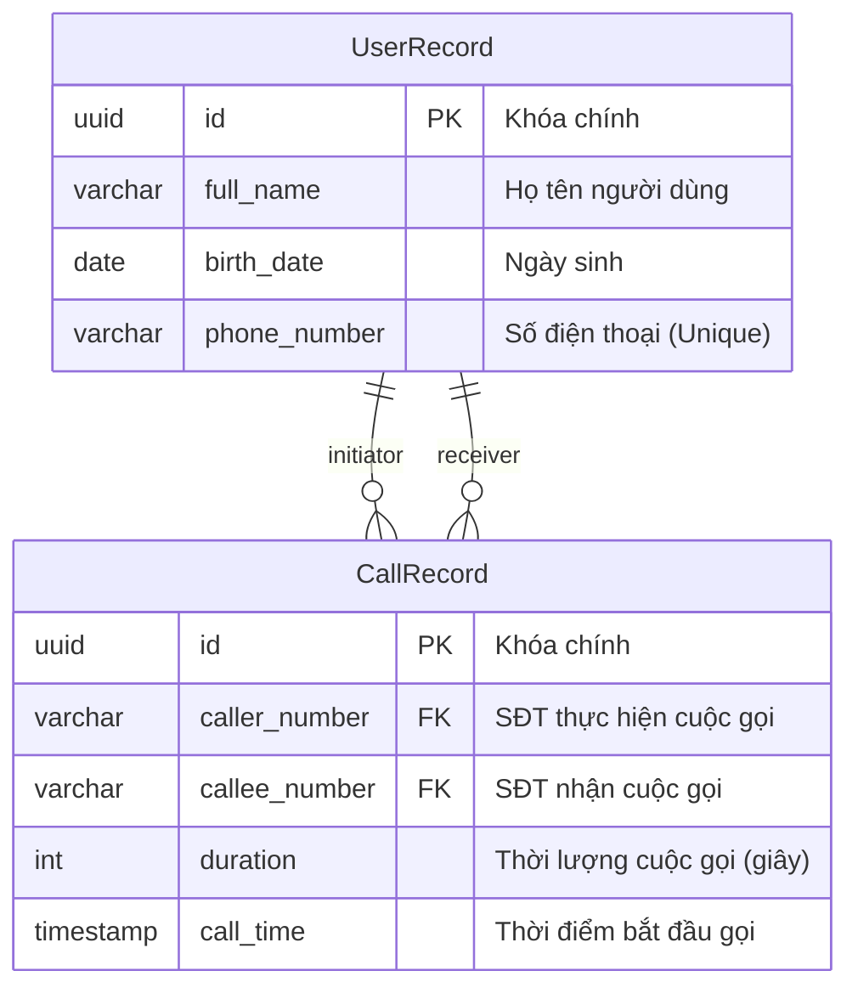
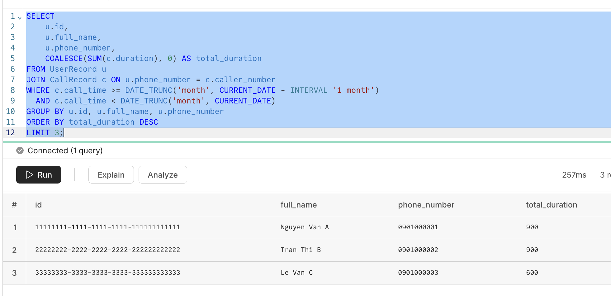
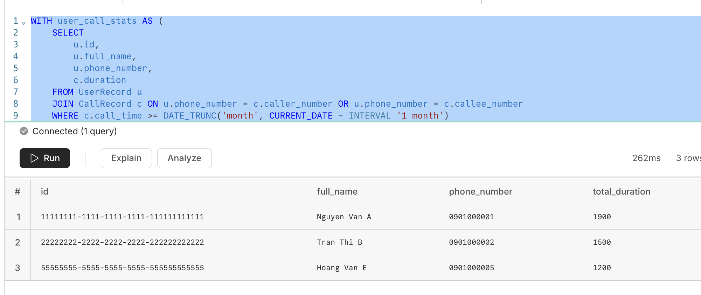
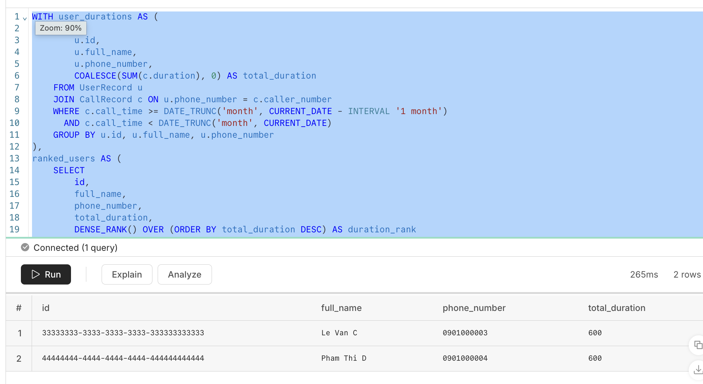
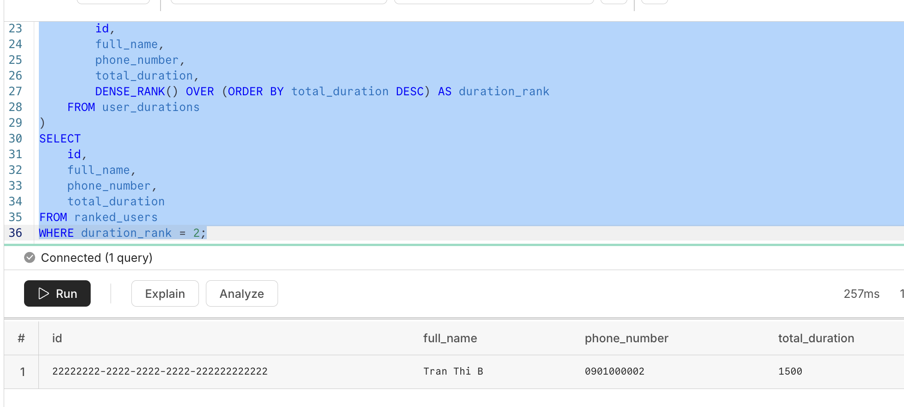

# Test 4 - Thiết kế Hệ thống Lưu trữ Thông tin Viễn thông

## I. Sơ đồ Thực thể Quan hệ (ERD)



### Giải thích thiết kế:
*   Mỗi cuộc gọi cần lưu thông tin của cả số điện thoại gọi (`caller_number`) và số điện thoại được gọi (`callee_number`).
*   Một người dùng (`UserRecord`) có thể đóng vai trò là **Người thực hiện cuộc gọi** (initiator) hoặc **Người nhận cuộc gọi** (receiver) trong nhiều bản ghi cuộc gọi (`CallRecord`). Vì vậy, có hai quan hệ 1-N nối từ bảng `UserRecord` tới bảng `CallRecord`.

---

## II. Câu lệnh Tạo bảng (DDL - PostgreSQL)

```sql
CREATE TABLE UserRecord (
    id UUID PRIMARY KEY,
    full_name VARCHAR(100) NOT NULL,
    birth_date DATE NOT NULL,
    phone_number VARCHAR(20) NOT NULL UNIQUE
);

CREATE TABLE CallRecord (
    id UUID PRIMARY KEY,
    caller_number VARCHAR(20) NOT NULL REFERENCES UserRecord(phone_number),
    callee_number VARCHAR(20) NOT NULL REFERENCES UserRecord(phone_number),
    duration INT NOT NULL CHECK (duration >= 0),
    call_time TIMESTAMP NOT NULL
);

CREATE INDEX idx_call_time ON CallRecord(call_time);
CREATE INDEX idx_call_caller ON CallRecord(caller_number);
CREATE INDEX idx_call_callee ON CallRecord(callee_number);
```

---

## III. Câu lệnh Truy vấn SQL

Do đề bài không chỉ định cụ thể *"tổng thời lượng cuộc gọi"* chỉ tính các cuộc gọi đi (Caller) hay tính cả cuộc gọi nhận (Callee), tài liệu cung cấp **cả 2 trường hợp**:
*   **Trường hợp 1 (Chỉ tính cuộc gọi đi):** User là người chủ động thực hiện cuộc gọi (`caller_number`).
*   **Trường hợp 2 (Tính tổng cả cuộc gọi đi và cuộc gọi nhận):** User tham gia vào cuộc gọi với vai trò `caller_number` hoặc `callee_number` (Thực tế viễn thông thường dùng phương án này).

### 1. Top 3 User có tổng thời lượng cuộc gọi lớn nhất trong tháng vừa rồi

#### Trường hợp 1: Chỉ tính cuộc gọi đi (User là Caller)
```sql
SELECT 
    u.id,
    u.full_name,
    u.phone_number,
    COALESCE(SUM(c.duration), 0) AS total_duration
FROM UserRecord u
JOIN CallRecord c ON u.phone_number = c.caller_number
WHERE c.call_time >= DATE_TRUNC('month', CURRENT_DATE - INTERVAL '1 month')
  AND c.call_time < DATE_TRUNC('month', CURRENT_DATE)
GROUP BY u.id, u.full_name, u.phone_number
ORDER BY total_duration DESC
LIMIT 3;
```
Kết quả:


#### Trường hợp 2: Tính cả cuộc gọi đi và cuộc gọi nhận (User là Caller hoặc Callee)
```sql
WITH user_call_stats AS (
    SELECT 
        u.id,
        u.full_name,
        u.phone_number,
        c.duration
    FROM UserRecord u
    JOIN CallRecord c ON u.phone_number = c.caller_number OR u.phone_number = c.callee_number
    WHERE c.call_time >= DATE_TRUNC('month', CURRENT_DATE - INTERVAL '1 month')
      AND c.call_time < DATE_TRUNC('month', CURRENT_DATE)
)
SELECT 
    id,
    full_name,
    phone_number,
    SUM(duration) AS total_duration
FROM user_call_stats
GROUP BY id, full_name, phone_number
ORDER BY total_duration DESC
LIMIT 3;
```
Kết quả:


---

### 2. Tìm những User có tổng thời lượng cuộc gọi lớn thứ 2 (Hỗ trợ xử lý đồng hạng)

#### Trường hợp 1: Chỉ tính cuộc gọi đi (User là Caller)
```sql
WITH user_durations AS (
    SELECT 
        u.id,
        u.full_name,
        u.phone_number,
        COALESCE(SUM(c.duration), 0) AS total_duration
    FROM UserRecord u
    JOIN CallRecord c ON u.phone_number = c.caller_number
    WHERE c.call_time >= DATE_TRUNC('month', CURRENT_DATE - INTERVAL '1 month')
      AND c.call_time < DATE_TRUNC('month', CURRENT_DATE)
    GROUP BY u.id, u.full_name, u.phone_number
),
ranked_users AS (
    SELECT 
        id,
        full_name,
        phone_number,
        total_duration,
        DENSE_RANK() OVER (ORDER BY total_duration DESC) AS duration_rank
    FROM user_durations
)
SELECT 
    id,
    full_name,
    phone_number,
    total_duration
FROM ranked_users
WHERE duration_rank = 2;
```
Kết quả:


#### Trường hợp 2: Tính cả cuộc gọi đi và cuộc gọi nhận (User là Caller hoặc Callee)
```sql
WITH user_call_stats AS (
    SELECT 
        u.id,
        u.full_name,
        u.phone_number,
        c.duration
    FROM UserRecord u
    JOIN CallRecord c ON u.phone_number = c.caller_number OR u.phone_number = c.callee_number
    WHERE c.call_time >= DATE_TRUNC('month', CURRENT_DATE - INTERVAL '1 month')
      AND c.call_time < DATE_TRUNC('month', CURRENT_DATE)
),
user_durations AS (
    SELECT 
        id,
        full_name,
        phone_number,
        SUM(duration) AS total_duration
    FROM user_call_stats
    GROUP BY id, full_name, phone_number
),
ranked_users AS (
    SELECT 
        id,
        full_name,
        phone_number,
        total_duration,
        DENSE_RANK() OVER (ORDER BY total_duration DESC) AS duration_rank
    FROM user_durations
)
SELECT 
    id,
    full_name,
    phone_number,
    total_duration
FROM ranked_users
WHERE duration_rank = 2;
```

Kết quả:


---
### Data test

```
INSERT INTO UserRecord (id, full_name, birth_date, phone_number)
VALUES
('11111111-1111-1111-1111-111111111111', 'Nguyen Van A', '1998-05-10', '0901000001'),
('22222222-2222-2222-2222-222222222222', 'Tran Thi B', '1999-08-15', '0901000002'),
('33333333-3333-3333-3333-333333333333', 'Le Van C', '2000-02-20', '0901000003'),
('44444444-4444-4444-4444-444444444444', 'Pham Thi D', '1997-11-30', '0901000004'),
('55555555-5555-5555-5555-555555555555', 'Hoang Van E', '2001-01-25', '0901000005');

INSERT INTO CallRecord (
    id,
    caller_number,
    callee_number,
    duration,
    call_time
)
VALUES
('aaaaaaaa-aaaa-aaaa-aaaa-aaaaaaaaaaa1', '0901000001', '0901000002', 300, '2026-05-03 09:00:00'),
('aaaaaaaa-aaaa-aaaa-aaaa-aaaaaaaaaaa2', '0901000001', '0901000003', 250, '2026-05-10 14:20:00'),
('aaaaaaaa-aaaa-aaaa-aaaa-aaaaaaaaaaa3', '0901000001', '0901000004', 350, '2026-05-22 18:15:00'),
('aaaaaaaa-aaaa-aaaa-aaaa-aaaaaaaaaaa4', '0901000002', '0901000001', 400, '2026-05-05 10:30:00'),
('aaaaaaaa-aaaa-aaaa-aaaa-aaaaaaaaaaa5', '0901000002', '0901000005', 500, '2026-05-15 08:45:00'),
('aaaaaaaa-aaaa-aaaa-aaaa-aaaaaaaaaaa6', '0901000003', '0901000004', 200, '2026-05-07 11:00:00'),
('aaaaaaaa-aaaa-aaaa-aaaa-aaaaaaaaaaa7', '0901000003', '0901000005', 400, '2026-05-28 20:10:00'),
('aaaaaaaa-aaaa-aaaa-aaaa-aaaaaaaaaaa8', '0901000004', '0901000001', 600, '2026-05-12 13:00:00'),
('aaaaaaaa-aaaa-aaaa-aaaa-aaaaaaaaaaa9', '0901000005', '0901000002', 300, '2026-05-18 16:40:00');
```
